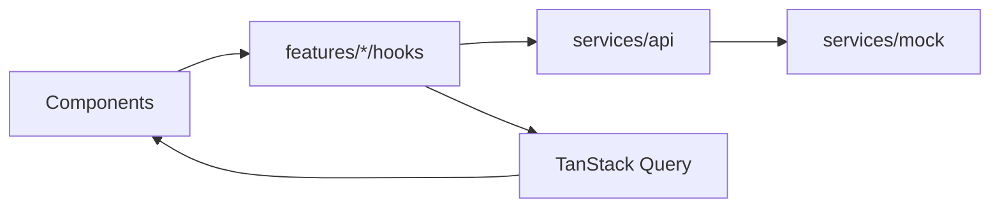

# Architecture

LeadFlow is a React 19 + Vite + TypeScript app. Data flows one way: a screen renders from a TanStack Query hook, and the hook calls `services/api`. The mock in `services/mock` is one implementation of that interface.

## Boundaries

- Components do not import `services/mock` or call `api` directly.
- Statuses, sources, stages, tags, and custom fields are records, not enums.
- Currency goes through `src/lib/format/currency.ts`. The workspace currency supplies the symbol.
- Routes are lazy. Recharts and `@dnd-kit` load on first use of a chart, the pipeline board, the calendar, or a sortable settings list.
- Query keys include tenant id, user id, and role so one user's cache cannot satisfy another session.

## Permissions

`usePermission` reads the signed-in role's matrix. The mock repeats the check on the server side of the interface: a hidden button is not the only guard. Data scope limits lists to the caller's own rows, their team, or the whole tenant.

## Offline and updates

`onlineManager` follows `navigator.onLine`. An offline banner explains that lists stay as loaded. The service worker precaches the shell (`vite-plugin-pwa`, `autoUpdate`) and shows an in-app refresh prompt. Install is offered only when the browser fires `beforeinstallprompt`.

## Real backend

Replace the mock behind `services/api` without changing hooks. Network-first for data. Never cache an authenticated response under a key that omits the tenant. Keep tenant isolation, role scope, permission checks, activity and audit writes, duplicate checks, scoring, and assignment.
